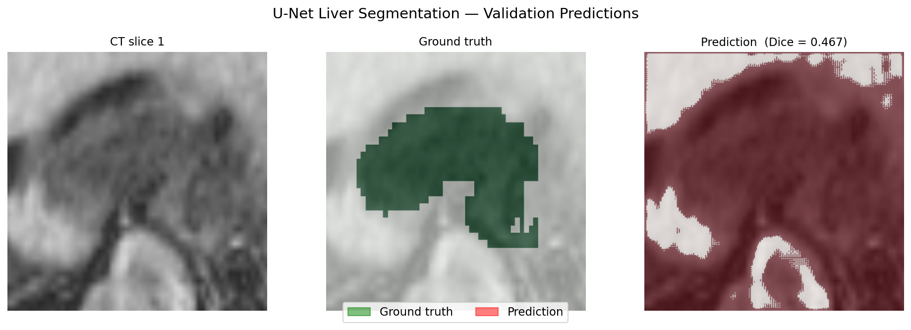
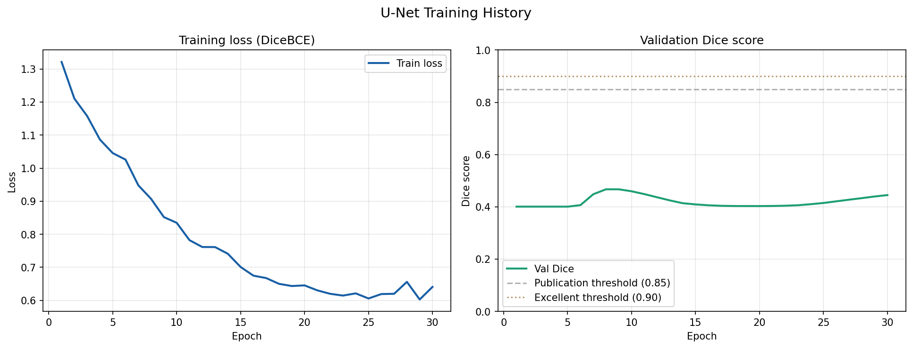

# Medical Image Segmentation — U-Net (PyTorch)

Liver segmentation on CT scans using a **U-Net trained from scratch** in PyTorch.  
Trained on the [Medical Segmentation Decathlon](http://medicaldecathlon.com/) Task03 dataset.

> **CV project** — built as part of a focused ML study plan targeting medical imaging roles.

---

## Results

| Metric    | Score  |
|-----------|--------|
| Dice      | —      |
| IoU       | —      |
| Precision | —      |
| Recall    | —      |

> Fill in your scores after running `python evaluate.py`

### Predictions



### Training curves



---

## Architecture

**U-Net** with 4 encoder levels and symmetric decoder:

```
Input (1×256×256)
  → Encoder: 64 → 128 → 256 → 512 channels  (MaxPool2d between levels)
  → Bottleneck: 1024 channels
  → Decoder:  512 → 256 → 128 → 64 channels  (ConvTranspose2d + skip concat)
  → Output (1×256×256)  binary segmentation mask
```

- **Skip connections** — concatenate encoder feature maps to decoder (not add)
- **ConvBlock** — two Conv2d + BatchNorm2d + ReLU layers per level
- **DiceBCE loss** — combines Dice loss (handles class imbalance) with BCE (stable gradients)
- **~31M parameters**, trained on 2D axial CT slices extracted from 3D volumes

---

## Dataset

**Medical Segmentation Decathlon — Task03 Liver**  
- 131 CT volumes with expert liver + tumour segmentation masks  
- Soft tissue windowing (WC=−75, WW=400 HU)  
- ~5,000 2D axial slices extracted at 256×256  
- 85% train / 15% validation split

---

## Setup

### Requirements
- Python 3.9+
- CUDA GPU recommended (CPU works but slow)
- ~10GB disk space for dataset

### Install

```powershell
# Clone the repo
git clone https://github.com/YOUR_USERNAME/medical-image-segmentation.git
cd medical-image-segmentation

# Create virtual environment
python -m venv venv
venv\Scripts\activate        # Windows PowerShell
# source venv/bin/activate   # Linux/Mac

# Install dependencies
pip install -r requirements.txt
```

### Download dataset

```powershell
# Download Medical Segmentation Decathlon Task03 (~8 GB)
gdown --id 1jyVGUGyxKBXV6_9ivuZapQS8eUJXCIpu

# Extract
tar -xf Task03_Liver.tar
```

---

## Usage

### Step 1 — Preprocess (run once)

```powershell
python data/preprocess.py --data_dir Task03_Liver --out_dir slices
```

Extracts ~5,000 2D axial slices with liver content → saves as `.npy` files.

### Step 2 — Sanity check

```powershell
python evaluate.py --sanity_check
```

Opens `assets/sanity_check.png` — verify CT slices and masks are aligned.

### Step 3 — Train

```powershell
python train.py --epochs 30 --batch_size 16 --lr 1e-4

# Low VRAM (8GB or less):
python train.py --epochs 30 --batch_size 8 --num_workers 0
```

### Step 4 — Evaluate

```powershell
python evaluate.py --checkpoint checkpoints/unet_best.pt
```

Generates `assets/predictions.png` and `assets/training_curves.png`.

---

## Project structure

```
medical-image-segmentation/
├── model/
│   ├── unet.py        ← UNet, ConvBlock, UpBlock
│   └── losses.py      ← DiceBCELoss, dice_score, iou_score
├── data/
│   ├── preprocess.py  ← NIfTI loading, windowing, slice extraction
│   └── dataset.py     ← LiverSliceDataset, get_dataloaders
├── train.py           ← full training loop with checkpointing
├── evaluate.py        ← metrics, visualisation, sanity check
├── requirements.txt
├── assets/            ← saved plots (tracked by git)
└── checkpoints/       ← saved model weights (gitignored)
```

---

## Key implementation details

**Why Dice loss?** In liver CT, the organ occupies ~10% of the image. Standard BCE gets 90% accuracy by predicting all background. Dice measures pixel-level overlap, making it robust to class imbalance — critical in medical imaging.

**Why 2D slices?** A full 3D U-Net on 512×512×300 volumes requires >24GB VRAM. Extracting 2D axial slices lets any GPU train effectively while still learning liver-specific appearance. For production, 2.5D (stacking adjacent slices as channels) or patch-based 3D would be the next step.

**Why concatenate skips (not add)?** Concatenation preserves both the encoder's spatial precision and the decoder's semantic context as separate channels — the subsequent ConvBlock learns how to mix them. Addition blends them irrecoverably, losing fine boundary information.

---

## References

- [U-Net: Convolutional Networks for Biomedical Image Segmentation](https://arxiv.org/abs/1505.04597) — Ronneberger et al., 2015
- [Medical Segmentation Decathlon](http://medicaldecathlon.com/) — Simpson et al., 2019
